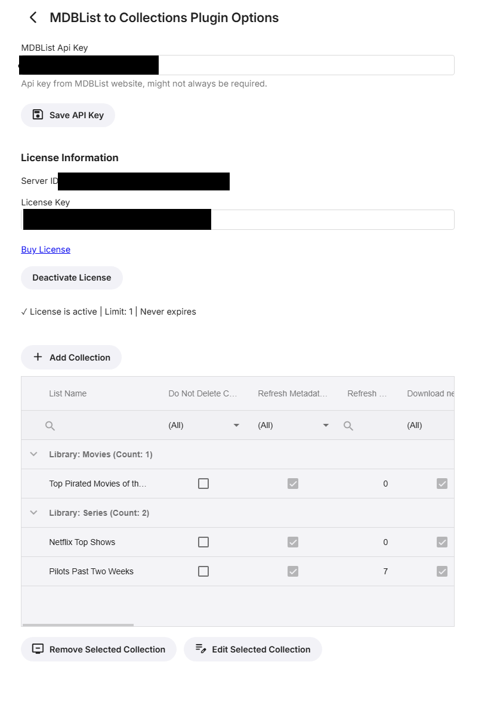

# 🎬 Emby MDBList Collections Plugin 📽️


### _"Your collections are about to get LEGENDARY!"_ 🏆

[](LICENSE)
[](https://emby.media)
[](https://mdblist.com)
[](https://github.com)

---

## 🍿 ATTENTION ALL MOVIE BUFFS! 🍿

**Fellow Collectors!** Are you tired of manually creating collections? Do you drool over those perfectly curated MDBList lists but dread the thought of adding each movie by hand? 

This plugin is your **HOLY GRAIL** of collection management! It automatically transforms ANY MDBList into a beautiful Emby collection faster than you can say "Director's Cut"! No more copying and pasting, no more missed titles - just pure, automated collection bliss! 

### 📺 "It's like having a personal assistant who REALLY gets your movie obsession!" 

---

## 🎯 Features That'll Make You Jump Off Your Couch!

- **🎬 Auto-Magic Collection Creation** - Turn any MDBList into an Emby collection with ZERO effort!
- **🔄 Smart Sync Technology** - Collections stay fresh with customizable update schedules
- **📚 Multi-Library Support** - Movies, TV Shows, whatever floats your cinematic boat!
- **🕐 Cron Scheduling** - Update collections on YOUR schedule (hourly, daily, weekly, or get crazy with custom cron!)
- **📅 Active/Deactive Dates** - Schedule when collections become active or automatically delete them on a set date!
- **🖼️ Custom Collection Images** - Set custom poster images for your collections with automatic embedding in activity logs
- **⚡ Force Update** - Override schedules for immediate collection updates when you can't wait!
- **🔃 Metadata Refresh** - Keep your posters and info looking fresher than theater popcorn
- **🔐 License Protected** - Because quality plugins deserve support!

---

## 🎮 Configuration Dashboard (Your Collection Command Center)

### 🔑 **License Activation** (Join the Elite Collectors Club)
```yaml
License Key: [Your-Golden-Ticket-Here]
Server ID: [Auto-Generated-Collection-HQ-ID]
Status: ✅ Premium Collector / ❌ Window Shopping
```

### 🎯 **MDBList API Setup** (Your Gateway to List Paradise)

**MDBList API Key:** *(Optional but recommended for rate limiting)*
```
[Your-MDBList-API-Key-Here]
```

### 📚 **Collection Configuration** (Where the Magic Happens)

**For Each MDBList You Add:**

| Setting | What It Does | Default |
|---------|--------------|---------|
| 📝 **List Name** | What to call your collection | Required |
| 🔗 **MDBList URL** | The list you want to sync | Required |
| 📂 **Target Library** | Where to create the collection | Required |
| 🔄 **Cron Schedule** | When to update (e.g., `0 2 * * *` = 2 AM daily) | Daily |
| 📅 **Active Date** | When collection becomes active | Today |
| 📅 **Deactive Date** | When to automatically delete collection | Never |
| 🖼️ **Collection Image** | Custom poster image for the collection | Optional |
| ⚡ **Force Update** | Ignore schedule and update on next run | OFF |
| 🚫 **Don't Delete Collection** | Keep collection, just update contents | OFF |
| 🔃 **Refresh Metadata** | Update item metadata on sync | Optional |
| 🎨 **Download New Images** | Grab fresh posters/art | Optional |

**Schedule Examples for Non-Cron Wizards:**
- `@hourly` - Every hour on the hour
- `@daily` - Once a day at midnight  
- `@weekly` - Every Sunday at midnight
- `0 */6 * * *` - Every 6 hours
- `0 2 * * 1` - Every Monday at 2 AM

---

## 🚀 How This Sorcery Works

1. **🔍 List Discovery** - Fetches your MDBList faster than you can grab popcorn
2. **🎯 Smart Matching** - Uses IMDB/TVDB IDs to find items in YOUR library
3. **📦 Collection Assembly** - Groups everything into a shiny new collection
4. **🔄 Scheduled Updates** - Keeps checking for new additions based on your schedule
5. **📊 Activity Logging** - Shows you exactly what was added/updated/skipped with beautiful HTML reports

---

## 📦 Installation (Your Journey to Collection Nirvana)

1. **💳 Purchase a License** - Support the obsession!
2. **📁 Drop the DLL** - Into your Emby plugins folder
3. **🔄 Restart Emby** - Give it the old reboot
4. **🎯 Navigate to Settings** - Plugins > MDBList Collections
5. **🔑 Enter License Key** - Prove you're a serious collector
6. **✅ Activate** - Welcome to the club!
7. **🎭 Add MDBList API Key** - Optional but recommended for better performance
8. **➕ Add Collections** - Go wild! Add ALL the lists!

---

## 🎬 Epic Use Cases (Real Collector Scenarios)

### 🏆 **The Rating Chaser**
Sync "IMDB Top 250" - Instant classic collection!

### 🎃 **The Holiday Enthusiast**  
Auto-update "Halloween Horror Movies" - Ready every October!

### 📈 **The Trending Tracker**
Daily sync "MDBList Popular This Week" - Always current!

### 🎭 **The Genre Master**
"Best Sci-Fi Movies Ever" + "Classic Film Noir" + "90s Action Heroes" = Triple threat!

### 🌍 **The World Cinema Buff**
"Criterion Collection Must-Watch" - Sophisticated AND automated!

### 📅 **The Seasonal Organizer**
Set "Christmas Movies" to activate December 1st and deactivate January 2nd - Perfect timing!

### 🎨 **The Visual Curator**
Add custom collection posters that appear in beautiful activity logs - Show off your style!

---

## ⚙️ Pro Tips (From One Collector to Another)

- **Start Small** - Test with one list before going collection crazy
- **Check Your Matches** - Activity log shows what was found/missed with gorgeous visuals if you add collection images
- **Cron Carefully** - Don't update every minute (your server will thank you)
- **Use Force Update** - Perfect for testing configurations or immediate updates when schedules don't match your excitement
- **Plan Your Dates** - Set active dates for future releases, deactive dates for seasonal cleanup
- **Image Quality** - Use high-resolution poster images (they get resized automatically to look amazing)
- **Metadata Matters** - Enable refresh for lists that frequently update ratings/posters
- **Library Logic** - Make sure you're pointing to the RIGHT library!

---

## ⚠️ Important Notes (The Fine Print Nobody Reads)

- **License = Love** - One license per server, no sharing (we're watching! 👀)
- **MDBList Limits Apply** - Be nice to their API, space out your updates
- **Missing Items** - Can only add what's IN your library (we're not pirates!)
- **First Sync** - Might take a few minutes for large lists
- **Patience Young Padawan** - Collections appear after the scheduled task runs

---

## 🆘 Troubleshooting (When Collections Go Rogue)

**"My license isn't working!"**
- Double-check that license key (no extra spaces!)
- Verify your Server ID matches
- One server = One license (them's the rules!)

**"Collections aren't appearing!"**
- Check the activity log for clues
- Verify your MDBList API key is correct (if using one)
- Make sure the scheduled task ran (or run it manually!)
- Confirm items exist in your target library

**"Some movies are missing!"**
- Check if they're in your library
- Verify IMDB/TVDB IDs are present
- Look at the activity log for "No items found" messages

**"Updates aren't happening!"**
- Double-check your cron expression
- Look for errors in the Emby log
- Try running the task manually first

---

## 🎭 Collection Examples to Get You Started

**Must-Have Lists to Try:**
- `https://mdblist.com/lists/garycrawfordgc/top-movies-of-the-week`
- `https://mdblist.com/lists/linaspurinis/imdb-moviemeter-top-100`
- `https://mdblist.com/lists/linaspurinis/pixar-movies`
- Your own personal lists! (Yes, it works with those too!)

---

## 📝 License (The Collector's Agreement)

This is a premium Emby plugin for serious collectors.
- **One License = One Server** - No collection sharing!
- **Deactivate Before Moving** - Take your license with you
- **Support = Updates** - Keep the collections coming!

---

### 🎬 Remember: Life's too short for manual collections! 🎬

_"Automating collections since... wait, when did we start? Doesn't matter - IT'S AWESOME!"_

---

Made with 🍿 by developers who have WAY too many movies

**Version**: Your Collections Will Never Be The Same Edition™ 

**MDBList**: Don't forget to ❤️ those lists on MDBList!

---

## 🌟 Quick Start Challenge 🌟

**Can you create your first automated collection in under 5 minutes?**

1. Install ✓
2. Activate License ✓  
3. Add MDBList API Key (Optional) ✓
4. Add Your First List ✓
5. Run Task Manually ✓
6. 🎉 BOOM! Collection Created! 🎉

*Share your success with #EmbyMDBListCollections*

---

## Screen Shots

### Overview of the plugin dashboard:

### Adding a new collection:

### Collection activity log:


---

**P.S.** - If you're still creating collections manually in 2024, we need to talk... 😱
